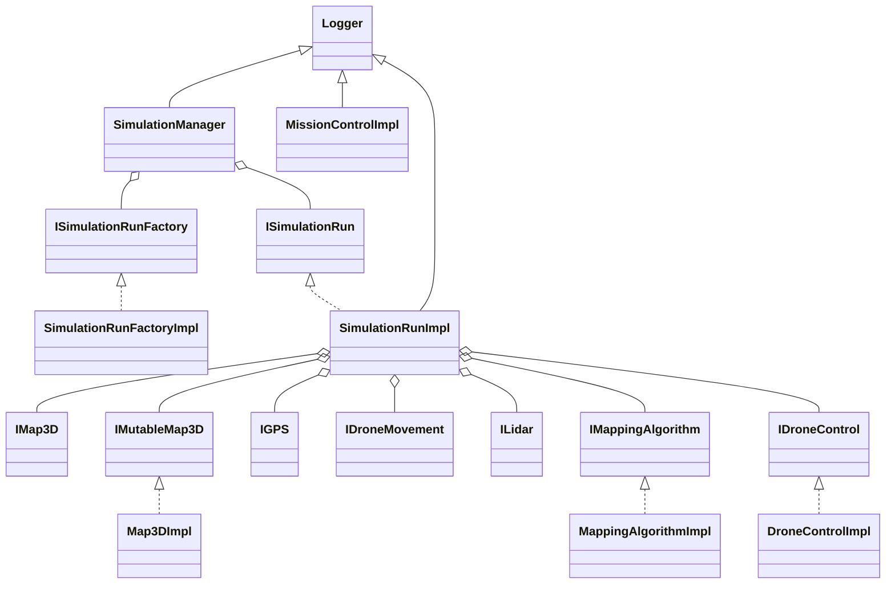
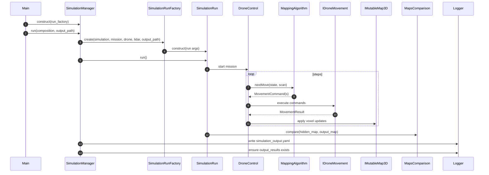

# High-Level Design (Assignment 2)

## Overview
This document describes the high-level architecture, runtime flow, and design/testing rationale for the Assignment 2 simulator skeleton and the ported mapping algorithm.

**Key components**
- `SimulationManager` — orchestrates simulation compositions and writes `simulation_output.yaml` and `output_results/` files.
- `SimulationRun` / `SimulationRunImpl` — bundles a single simulation run: hidden map, output map, sensors, movement, mapping, mission control.
- `DroneControlImpl` — runtime stepper invoking `IMappingAlgorithm` to get next movement commands.
- `MappingAlgorithmImpl` — port of the exercise mapping algorithm (sweep + BFS + DDA ray marking).
- `Map3DImpl` / `IMap3D` / `IMutableMap3D` — map storage with offset-aware coordinates and contiguous 1D backing.
- `Logger` — synchronous immediate error logging to `output_results/error_log.txt`.

## Class Diagram

## Sequence Diagram (Main flow)

## Design Considerations

- Strong typing with `mp-units`:
  - Distinguishes `XLength`, `YLength`, `ZLength`, `PhysicalLength`, and angles.
  - Prevents inadvertent mixing of units and helps produce safer arithmetic.

- Dependency injection and interfaces:
  - All runtime components are injected via interfaces (`IGPS`, `ILidar`, `IDroneMovement`, `IMappingAlgorithm`, `IMutableMap3D`) to allow mocking and isolation in tests.

- Exact string preservation:
  - All predefined error codes (e.g., `MISSION_BOUNDARY_INVALID`, `OUTPUT_MAP_SAVE_FAILED`, `SIMULATION_RUN_EXCEPTION`) are preserved exactly as required by the assignment and test harness.
  - `Logger` writes identical strings to `output_results/error_log.txt` synchronously.

- Map representation:
  - `Map3DImpl` uses a contiguous 1D `std::vector<int8_t>` for performance and stable serialization with TinyNPY.
  - `Map3DImpl` respects `types::MapConfig` offsets and resolution when converting world-space `Position3D` to voxel indices.

## Ex1 Lessons Incorporated (HW1 -> EX2)

- The original HW1 mapping algorithm (Hybrid Exploration) was ported without algorithmic changes into `MappingAlgorithmImpl`.
  - Deterministic Sweep + BFS exploration: the drone performs lateral sweeps scanning with DDA ray traversal to mark voxels, detects frontiers, and uses BFS to plan paths to the next frontier.
  - Targeted scans handle blind spots and partial observations during the sweep.
  - Command splitting and chunking behavior is preserved (logical movement commands are produced by the mapping algorithm; `DroneControlImpl` / movement drivers enforce hardware limits).

- Separation of concerns preserved:
  - The simulator maintains a ground-truth `hidden_map` (used by LiDAR/MockLidar) while the drone builds an independent `output_map` through sensor observations.
  - `MapsComparison` samples overlapping voxels respecting offsets/resolution to compute scores; errors return `-1`.

## Testing Approach

- Unit tests (GTest + GMock):
  - Component tests under `tests/components/` use mocks to isolate behavior (e.g., `MockLidar`, `MockMovement`).
  - All test suites follow exact names to support `--gtest_filter` usage (Integration, SimulationManager, SimulationRun, MissionControl, DroneControl, MappingAlgorithm, MockLidar, MapsComparison).

- Integration tests:
  - End-to-end runs via `SimulationManager` using the real `SimulationRunFactoryImpl` and `MappingAlgorithmImpl`.
  - Error handling tests assert that failures produce `-1` mission scores and populate `error_log.txt` appropriately.

- Resilience testing:
  - Inject failing `IDroneMovement` implementations to simulate collisions and ensure the simulation logs error codes and returns graceful results.

### Anti-Fragility and Scoring Rules

- Tests use `GMock` to enforce strict component isolation and to simulate adverse conditions (anti-fragility): failing actuators, missing maps, or sensor anomalies.
- The grading and tests require that single scenario failures (e.g., movement failure) or group scenario issues (e.g., missing map file) cause the mission score to be `-1` and an appropriate `error_ref` to be recorded in `simulation_output.yaml`.

### Port Validation

- Porting from HW1 preserved the exact logical behavior of the mapping algorithm; unit and integration tests validate parity by exercising sweep, BFS frontier resolution, and the produced output maps.

## Notes

- `README.md` contains the exact output schema for `simulation_output.yaml` and `output_results/` layout.
- The code intentionally keeps the public interfaces and factory signatures unchanged.
