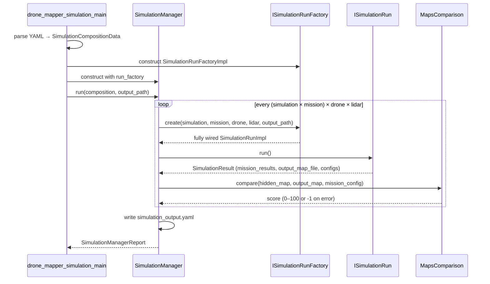
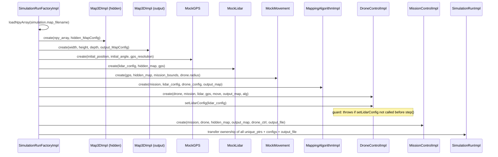
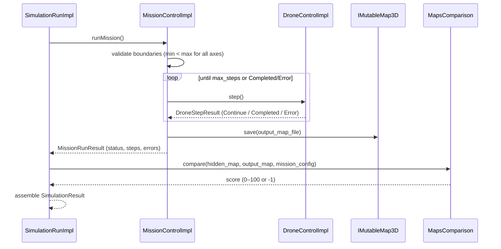
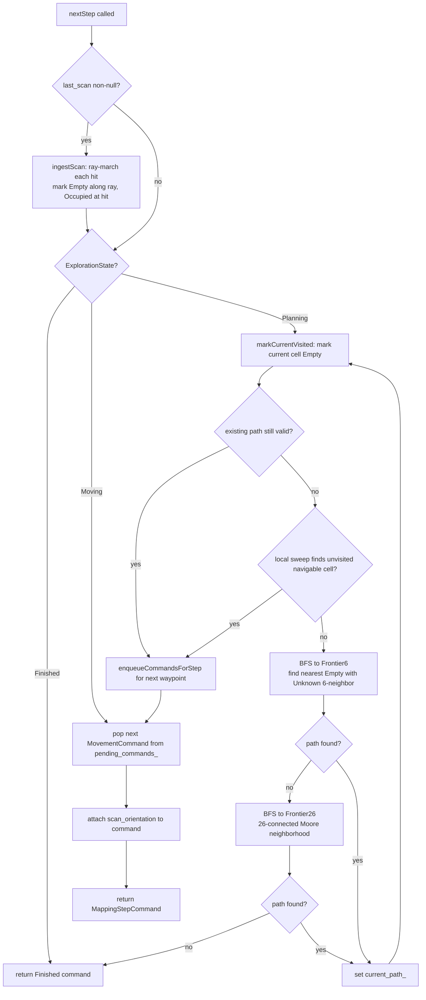

# Drone Mapper — Assignment 2 HLD

## Main Components

- `SimulationManager` is the top-level runner. It receives `types::SimulationCompositionData`, expands the Cartesian product of all simulation/mission/drone/lidar combinations, and aggregates a `types::SimulationManagerReport`.
- `ISimulationRunFactory` is the single construction seam. It creates one fully wired run node per combination.
- `SimulationRunImpl` owns the full per-node runtime object graph (maps, sensors, drone control, mission control). It holds configs and the output map path needed to return `types::SimulationResult`.
- `MissionControlImpl` drives the step loop, saves the output map, and returns mission-level status and errors.
- `DroneControlImpl` receives configs and references to all dependencies at construction. Each `step()` call queries the mapping algorithm, executes the resulting command, fires the LiDAR if the algorithm requested a scan, applies voxels to the output map, and forwards the scan result to the algorithm on the next step. A guard at the top of `step()` throws `std::runtime_error` if `setLidarConfig()` was not called beforehand.
- `MappingAlgorithmImpl` maintains an internal occupancy grid built from ingested scan results and uses Hybrid Exploration (adaptive local sweep + BFS frontier) to decide the next movement and scan orientation.
- `IMap3D` / `IMutableMap3D` — read-only and mutable voxel maps backed by `Map3DImpl`. Resolution, offset, and boundaries travel together as `types::MapConfig`.
- `MockLidar` ray-marches through the hidden map using the drone's GPS position and scan orientation. Step size is 0.1× the map resolution.
- `MockMovement` updates `MockGPS` after checking the hidden map for sphere-collision and verifying mission boundaries. Samples every 1 cm along the path.
- `MockGPS` stores and returns the exact position set by `MockMovement`. No rounding is applied; discretisation into grid cells is the algorithm's responsibility via `toGrid()`.
- `MapsComparison` scores the output map against the hidden map by sampling world-space coordinates within the mission boundaries.
- `ScanResultToVoxels` is a static utility that converts a `LidarScanResult` into `Empty` / `Occupied` / `PotentiallyOccupied` writes on the output map.
- `YamlConfig` parses all YAML configuration files. Converts `dimensions_cm` (drone diameter) to `radius = dimensions_cm / 2`. Resolves paths inside a composition file relative to that file's directory; resolves `map_filename` relative to CWD.

---

## Map Geometry and Results

- `types::MapConfig` — canonical bundle: `MappingBounds`, `Position3D offset`, `PhysicalLength resolution`.
- `types::MissionConfigData` — max steps, GPS resolution, `MappingBounds boundaries`, and optional output resolution factor.
- `types::MissionRunResult` — status (`Completed` / `MaxSteps` / `Error`), step count, and error list.
- `types::SimulationResult` — all configs for the run, mission results, output map file, output map config, resolution request status, and final score.
- `types::SimulationManagerReport` — timestamp, metric, score range, and flat list of `SimulationResult` runs.
- `types::SimulationCompositionData` — composition file path, vector of `(SimulationConfigData, vector<MissionConfigData>)` tuples, vector of `DroneConfigData`, vector of `LidarConfigData`.

---

## Strong Types

All physical quantities use the `mp-units` 2.5.0 library. Axis-specific quantity specs (`x_extent`, `y_extent`, `z_extent`) are distinct sub-kinds of `isq::length`, making cross-axis assignment a compile-time error.

```
PhysicalLength  = quantity<isq::length[cm], double>
XLength         = quantity<x_extent[cm], double>
YLength         = quantity<y_extent[cm], double>
ZLength         = quantity<z_extent[cm], double>
HorizontalAngle = quantity<horizontal_angle[deg], double>
AltitudeAngle   = quantity<altitude_angle[deg], double>
```

Values are always extracted with `.force_numerical_value_in(cm)` (unit, not reference) and always constructed as `50.0 * x_extent[cm]` (not `XLength{50.0 * cm}`).

---

## Class Diagram

```mermaid
classDiagram
    direction LR

    class ISimulation {
        <<interface>>
        +run(composition, output_path) report
    }

    class ISimulationRun {
        <<interface>>
        +run() result
    }

    class ISimulationRunFactory {
        <<interface>>
        +create(sim, mission, drone, lidar, output_path) run
    }

    class IMissionControl {
        <<interface>>
        +runMission() result
    }

    class IDroneControl {
        <<interface>>
        +step() step_result
        +state() state
    }

    class ILidar {
        <<interface>>
        +scan(orientation) scan_result
        +config() lidar_config
    }

    class IGPS {
        <<interface>>
        +position() position
        +heading() orientation
    }

    class IDroneMovement {
        <<interface>>
        +rotate(direction, angle) result
        +advance(distance) result
        +elevate(distance) result
    }

    class IMappingAlgorithm {
        <<interface>>
        +nextStep(state, latest_scan*) command
        #mission_config_
        #lidar_config_
        #drone_config_
        #output_map_
    }

    class IMap3D {
        <<interface>>
        +atVoxel(pos) occupancy
        +getMapConfig() config
        +isInBounds(pos) bool
    }

    class IMutableMap3D {
        <<interface>>
        +set(pos, value) void
        +save(output_file) void
    }

    class SimulationManager {
        +run(composition, output_path) report
    }

    class SimulationRunFactoryImpl {
        +create(...) SimulationRunImpl
    }

    class SimulationRunImpl {
        -hidden_map
        -output_map
        -gps
        -lidar
        -movement
        -algorithm
        -drone_control
        -mission_control
        +run() SimulationResult
    }

    class MissionControlImpl {
        +runMission() MissionRunResult
    }

    class DroneControlImpl {
        +step() DroneStepResult
        +state() DroneState
        +setLidarConfig(config)
    }

    class MappingAlgorithmImpl {
        -known_voxels_
        -current_path_
        -state_
        +nextStep(state, scan*) command
    }

    class MockGPS {
        +position() Position3D
        +heading() Orientation
        +setPosition(pos)
        +setHeading(hdg)
    }

    class MockLidar {
        +scan(orientation) LidarScanResult
        +config() LidarConfigData
    }

    class MockMovement {
        +rotate(dir, angle) result
        +advance(distance) result
        +elevate(distance) result
    }

    class Map3DImpl {
        +atVoxel(pos) occupancy
        +getMapConfig() config
        +isInBounds(pos) bool
        +set(pos, value)
        +save(path)
    }

    class ScanResultToVoxels {
        +applyToMap(map, pos, hdg, scan, cfg)$
    }

    class MapsComparison {
        +compare(original, target, config) score
    }

    ISimulation <|.. SimulationManager
    ISimulationRun <|.. SimulationRunImpl
    ISimulationRunFactory <|.. SimulationRunFactoryImpl
    IMissionControl <|.. MissionControlImpl
    IDroneControl <|.. DroneControlImpl
    ILidar <|.. MockLidar
    IGPS <|.. MockGPS
    IDroneMovement <|.. MockMovement
    IMappingAlgorithm <|.. MappingAlgorithmImpl
    IMap3D <|.. Map3DImpl
    IMutableMap3D <|.. Map3DImpl
    IMutableMap3D --|> IMap3D

    SimulationManager --> ISimulationRunFactory : uses
    SimulationManager --> ISimulationRun : calls run()
    SimulationManager --> MapsComparison : scores each run
    SimulationRunFactoryImpl --> SimulationRunImpl : creates
    SimulationRunImpl --> IMissionControl : owns
    SimulationRunImpl --> IDroneControl : owns
    SimulationRunImpl --> IMappingAlgorithm : owns
    SimulationRunImpl --> ILidar : owns
    SimulationRunImpl --> IGPS : owns
    SimulationRunImpl --> IDroneMovement : owns
    MissionControlImpl --> IDroneControl : ref
    MissionControlImpl --> IMutableMap3D : ref (output)
    DroneControlImpl --> IGPS : ref
    DroneControlImpl --> ILidar : ref
    DroneControlImpl --> IDroneMovement : ref
    DroneControlImpl --> IMutableMap3D : ref
    DroneControlImpl --> IMappingAlgorithm : ref
    MockLidar --> IMap3D : hidden map (ref)
    MockMovement --> IMap3D : hidden map (ref)
    MockMovement --> IGPS : ref
    MapsComparison --> IMap3D : both maps
```



---

## Top-Level Run Flow



---

## Factory Wiring Flow



---

## Mission Step Loop Flow



---

## DroneControl Step Flow

This diagram shows the complete internal flow of a single `DroneControlImpl::step()` call, including the LiDAR scan stored for the next step (closing e15 from HW1 review).

```mermaid
sequenceDiagram
    participant Mission as MissionControlImpl
    participant Drone   as DroneControlImpl
    participant Alg     as IMappingAlgorithm
    participant Move    as IDroneMovement
    participant GPS     as IGPS
    participant Lidar   as ILidar
    participant Map     as IMutableMap3D (output)
    participant Voxels  as ScanResultToVoxels

    Mission->>Drone: step()

    Note over Drone: Guard: throw if setLidarConfig() not called
    Drone->>Drone: check lidar_config_set_ flag

    Note over Drone: Build current DroneState from GPS
    Drone->>GPS: position()
    GPS-->>Drone: Position3D
    Drone->>GPS: heading()
    GPS-->>Drone: Orientation

    Note over Drone: Pass previous scan result (null on step 1)
    Drone->>Alg: nextStep(state, last_scan_ptr)
    Alg->>Alg: ingestScan(state, *last_scan_ptr) [if non-null]
    Note over Alg: ray-march each hit; mark Empty / Occupied in known_voxels_
    Alg->>Alg: decide next action (sweep / BFS frontier)
    Alg-->>Drone: MappingStepCommand {movement?, scan_orientation?, status}

    alt command has movement
        alt Rotate
            Drone->>Move: rotate(direction, angle)
        else Advance
            Drone->>Move: advance(distance)
            Note over Move: samples every 1cm; checks hidden map + mission bounds
        else Elevate
            Drone->>Move: elevate(distance)
            Note over Move: samples every 1cm; checks hidden map + mission bounds
        else Hover
            Note over Drone: no movement issued
        end
        Move-->>Drone: MovementResult {success, message}
        alt MovementResult.success == false
            Drone->>Drone: Logger::logError("DRONE_HITS_OBSTACLE")
            Drone-->>Mission: DroneStepResult{Error}
        end
    end

    alt command has scan_orientation
        Drone->>GPS: position() [post-move position]
        GPS-->>Drone: Position3D
        Drone->>Lidar: scan(scan_orientation)
        Note over Lidar: steps 0.1cm at a time; returns LidarHit per beam
        Lidar-->>Drone: LidarScanResult
        Drone->>Drone: last_scan_ = scan_result [stored for next step]
        Drone->>Voxels: applyToMap(output_map, position, heading, scan, lidar_config)
        Note over Voxels: marks Empty along ray, Occupied at hit (or PotentiallyOccupied if dist=0)
        Voxels->>Map: set(pos, occupancy) [for each sampled point]
    end

    Drone->>Drone: ++step_index_

    alt status == Finished or FinishedWithUnmappableVoxels
        Drone-->>Mission: DroneStepResult{Completed}
    else
        Drone-->>Mission: DroneStepResult{Continue}
    end
```

---

## Mapping Algorithm — Hybrid Exploration Strategy

The `MappingAlgorithmImpl` carries over the **Adaptive Sweep + BFS Frontier** strategy from Assignment 1 and adapts it to the `IMappingAlgorithm::nextStep` interface. It maintains an internal `known_voxels_` grid (separate from `output_map`) and uses cell-aligned movement at `gps_resolution_cm` per step.



**Cell size** = `gps_resolution_cm`. **toGrid(pos)** = `{ llround(x/cell), llround(y/cell), llround(z/cell) }`.

**isInsideMissionBounds(k)**: converts cell to world position via `toPosition(k)` and checks against `mission_config_.boundaries`. All-zero boundaries → unbounded (returns true for all cells).

**Important**: the initial drone position must be an exact multiple of `gps_resolution_cm`. Non-aligned positions cause `toGrid()` to snap to a different cell centre, making subsequent planned moves overshoot or cross mission boundaries.

---

## Error Handling

- All errors are logged immediately to `output_results/error_log.txt` via `Logger::logError` — never buffered or deferred.
- A failed run gets `mission_score = -1.0` and `MissionRunResult.status = Error`; remaining runs continue normally.
- A map-load failure in the factory throws; `SimulationManager` catches it and converts it to an error run without stopping other runs.
- `MissionControlImpl` rejects invalid boundaries (`min >= max` on any axis) immediately with code `MISSION_BOUNDARY_INVALID`.
- `MockMovement` returns `MovementResult{false, message}` on collision or boundary violation; `DroneControlImpl` logs `DRONE_HITS_OBSTACLE` and returns `DroneStepResult{Error}`.
- `DroneControlImpl::step()` throws `std::runtime_error("LiDAR config not set")` if `setLidarConfig()` was not called; caught by `SimulationRunImpl`.
