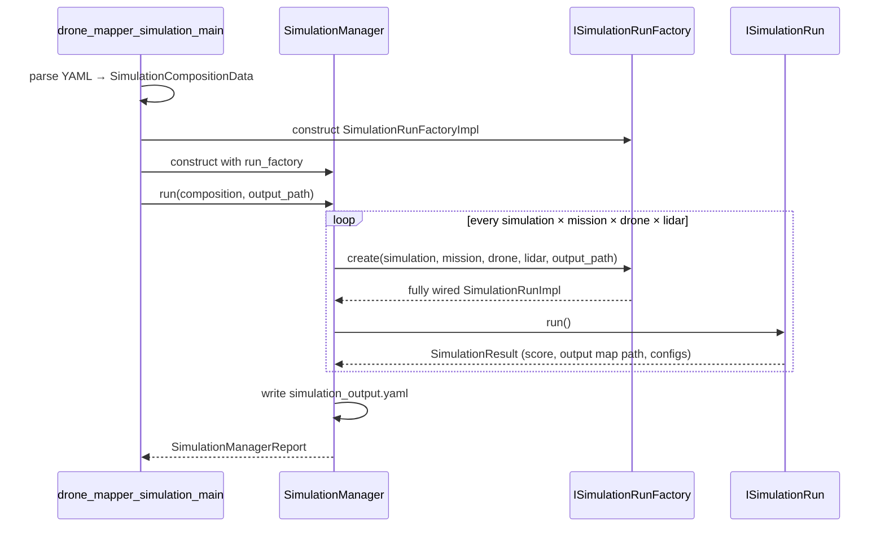
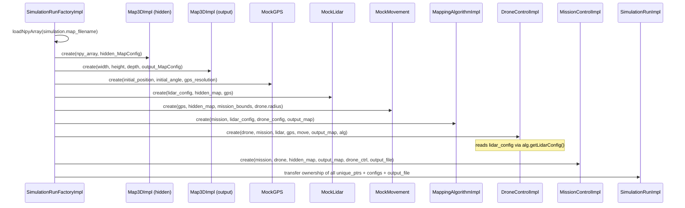
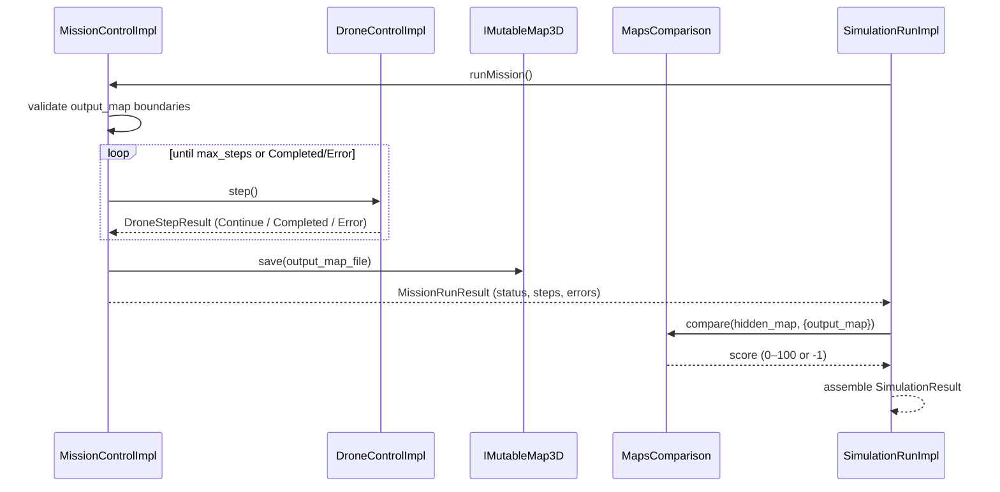
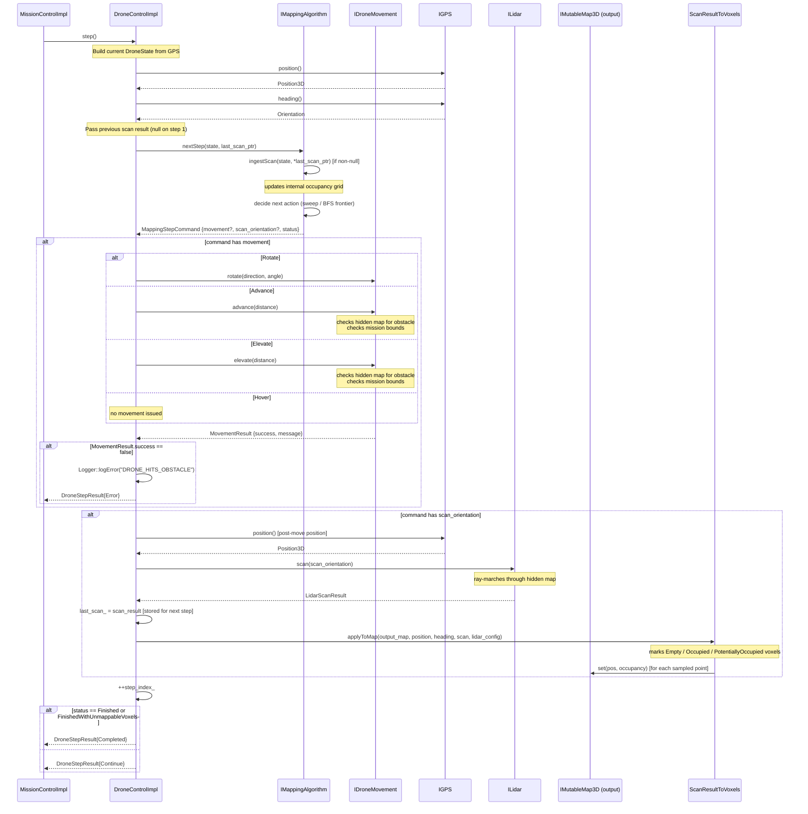
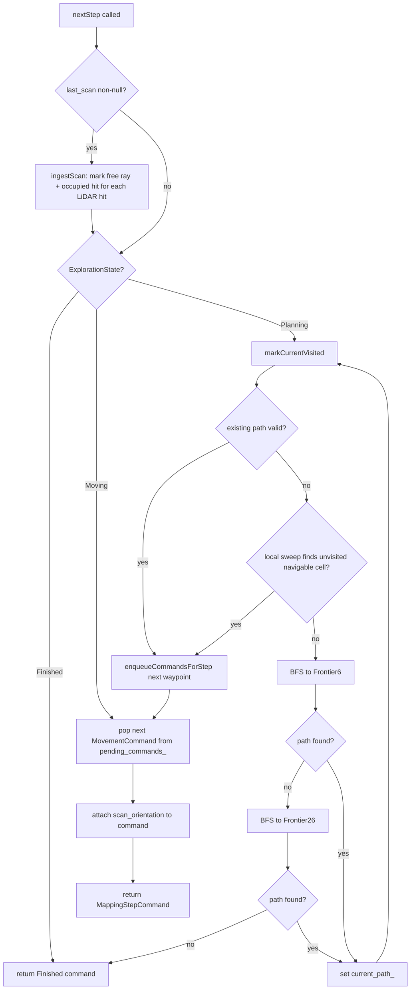

# Drone Mapper — Assignment 2 HLD

## Main Components

- `SimulationManager` is the top-level runner. It receives `types::SimulationCompositionData`, expands the Cartesian product of all simulation/mission/drone/lidar combinations, and aggregates a `types::SimulationManagerReport`.
- `ISimulationRunFactory` is the single construction seam. It creates one fully wired run node per combination.
- `SimulationRunImpl` owns the full per-node runtime object graph (maps, sensors, drone control, mission control). It holds configs and the output map path needed to return `types::SimulationResult`.
- `MissionControlImpl` drives the step loop, saves the output map, and returns mission-level status and errors.
- `DroneControlImpl` receives configs and references to all dependencies at construction. Each `step()` call queries the mapping algorithm, executes the resulting command, fires the LiDAR if the algorithm requested a scan, applies voxels to the output map, and forwards the scan result to the algorithm on the next step.
- `MappingAlgorithmImpl` maintains an internal occupancy grid built from ingested scan results and uses Hybrid Exploration (adaptive local sweep + BFS frontier) to decide the next movement and scan orientation.
- `IMap3D` / `IMutableMap3D` — read-only and mutable voxel maps backed by `Map3DImpl`. Resolution, offset, and boundaries travel together as `types::MapConfig`.
- `MockLidar` ray-marches through the hidden map using the drone's GPS position and scan orientation.
- `MockMovement` updates `MockGPS` after checking the hidden map for obstacles and verifying mission boundaries.
- `MapsComparison` scores the output map against the hidden map by sampling world-space coordinates.

---

## Map Geometry and Results

- `types::MapConfig` — canonical bundle: `MappingBounds`, `Position3D offset`, `PhysicalLength resolution`.
- `types::MissionConfigData` — max steps, GPS resolution, boundaries, and optional output resolution factor.
- `types::MissionRunResult` — status (`Completed` / `MaxSteps` / `Error`), step count, and error list.
- `types::SimulationResult` — all configs for the run, mission results, output map file, output map config, resolution request status, and final score.
- `types::SimulationManagerReport` — timestamp, metric, score range, and flat list of `SimulationResult` runs.

---

## Class Diagram

```mermaid
classDiagram
    direction LR

    class ISimulation {
        <<interface>>
        +run(composition, output_path) report
    }

    class ISimulationRun {
        <<interface>>
        +run() result
    }

    class ISimulationRunFactory {
        <<interface>>
        +create(sim, mission, drone, lidar, output_path) run
    }

    class IMissionControl {
        <<interface>>
        +runMission() result
    }

    class IDroneControl {
        <<interface>>
        +step() step_result
        +state() state
    }

    class ILidar {
        <<interface>>
        +scan(orientation) scan_result
    }

    class IGPS {
        <<interface>>
        +position() position
        +heading() orientation
    }

    class IDroneMovement {
        <<interface>>
        +rotate(direction, angle) result
        +advance(distance) result
        +elevate(distance) result
    }

    class IMappingAlgorithm {
        <<interface>>
        +nextStep(state, latest_scan*) command
        +getLidarConfig() lidar_config
        #mission_config_
        #lidar_config_
        #drone_config_
        #output_map_
    }

    class IMap3D {
        <<interface>>
        +atVoxel(pos) occupancy
        +getMapConfig() config
        +isInBounds(pos) bool
    }

    class IMutableMap3D {
        <<interface>>
        +set(pos, value) void
        +save(output_file) void
    }

    class SimulationManager {
        -unique_ptr~ISimulationRunFactory~ run_factory_
        +run(composition, output_path) report
    }

    class SimulationRunImpl {
        -unique_ptr~const IMap3D~ hidden_map_
        -unique_ptr~IMutableMap3D~ output_map_
        -unique_ptr~IGPS~ gps_
        -unique_ptr~IDroneMovement~ movement_
        -unique_ptr~ILidar~ lidar_
        -unique_ptr~IMappingAlgorithm~ mapping_algorithm_
        -unique_ptr~IDroneControl~ drone_control_
        -unique_ptr~IMissionControl~ mission_control_
        -SimulationConfigData simulation_config_
        -MissionConfigData mission_config_
        -DroneConfigData drone_config_
        -LidarConfigData lidar_config_
        -path output_map_file_
        +run() SimulationResult
    }

    class MissionControlImpl {
        -MissionConfigData mission_
        -DroneConfigData drone_
        -IMap3D& hidden_map_
        -IMutableMap3D& output_map_
        -IDroneControl& drone_control_
        -path output_map_file_
        +runMission() MissionRunResult
    }

    class DroneControlImpl {
        -DroneConfigData drone_
        -MissionConfigData mission_
        -LidarConfigData lidar_config_
        -optional~LidarScanResult~ last_scan_
        -ILidar& lidar_
        -IGPS& gps_
        -IDroneMovement& movement_
        -IMutableMap3D& output_map_
        -IMappingAlgorithm& mapping_algorithm_
        -size_t step_index_
        +step() DroneStepResult
        +state() DroneState
    }

    class MappingAlgorithmImpl {
        -map~GridKey,VoxelOccupancy~ known_voxels_
        -set visited_positions_
        -deque~MovementCommand~ pending_commands_
        -vector~GridKey~ current_path_
        -Position3D current_position_
        -Orientation orientation_
        -ExplorationState state_
        +nextStep(state, latest_scan*) MappingStepCommand
    }

    class MockLidar {
        -LidarConfigData config_
        -IMap3D& map_
        -IGPS& gps_
        +scan(orientation) LidarScanResult
    }

    class MockMovement {
        -MockGPS& gps_
        -IMap3D* hidden_map_
        -MappingBounds bounds_
        -PhysicalLength drone_radius_
        +advance(distance) MovementResult
        +elevate(distance) MovementResult
        +rotate(dir, angle) MovementResult
    }

    class Map3DImpl {
        -shared_ptr~NpyArray~ map_
        -MapConfig config_
        -vector~int8_t~ data_
        +atVoxel(pos) VoxelOccupancy
        +getMapConfig() MapConfig
        +isInBounds(pos) bool
        +set(pos, value) void
        +save(path) void
    }

    class MapsComparison {
        +compare(origin, targets) vector~double~
    }

    ISimulation       <|.. SimulationManager
    ISimulationRunFactory <|.. SimulationRunFactoryImpl
    ISimulationRun    <|.. SimulationRunImpl
    IMissionControl   <|.. MissionControlImpl
    IDroneControl     <|.. DroneControlImpl
    IMappingAlgorithm <|.. MappingAlgorithmImpl
    ILidar            <|.. MockLidar
    IDroneMovement    <|.. MockMovement
    IMap3D            <|-- IMutableMap3D
    IMutableMap3D     <|.. Map3DImpl

    SimulationManager      --> ISimulationRunFactory
    SimulationRunImpl      --> "1" IMap3D           : hidden map (owned)
    SimulationRunImpl      --> "1" IMutableMap3D    : output map (owned)
    SimulationRunImpl      --> IGPS
    SimulationRunImpl      --> IDroneMovement
    SimulationRunImpl      --> ILidar
    SimulationRunImpl      --> IMappingAlgorithm
    SimulationRunImpl      --> IDroneControl
    SimulationRunImpl      --> IMissionControl
    MissionControlImpl     --> IMap3D               : hidden map (ref)
    MissionControlImpl     --> IMutableMap3D        : output map (ref)
    MissionControlImpl     --> IDroneControl        : ref
    DroneControlImpl       --> ILidar               : ref
    DroneControlImpl       --> IGPS                 : ref
    DroneControlImpl       --> IDroneMovement       : ref
    DroneControlImpl       --> IMutableMap3D        : ref
    DroneControlImpl       --> IMappingAlgorithm    : ref
    MockLidar              --> IMap3D               : hidden map (ref)
    MockMovement           --> IMap3D               : hidden map (ref, optional)
    MapsComparison         --> IMap3D
```

---

## Top-Level Run Flow

---

## Factory Wiring Flow

---

## Mission Step Loop Flow

---

## DroneControl Step Flow (closes e15 — sequence diagram for DroneControl)

This diagram shows the complete internal flow of a single `DroneControlImpl::step()` call, including how the LiDAR scan result is stored and forwarded to the mapping algorithm on the next step.

---

## Mapping Algorithm — Hybrid Exploration Strategy

The `MappingAlgorithmImpl` carries over the **Adaptive Sweep + BFS Frontier** strategy from Assignment 1 and adapts it to the `IMappingAlgorithm::nextStep` interface.

---

## Error Handling

- All errors are logged immediately to `output_results/error_log.txt` via `Logger::logError`.
- A failed run gets `mission_score = -1` and its `MissionRunResult.status = Error`.
- A map-load failure in the factory throws, which `SimulationManager` catches and converts to an error run without stopping other runs.
- `MockMovement` returns `MovementResult{false, message}` on collision or boundary violation; `DroneControlImpl` propagates this as `DroneStepResult{Error}`.
